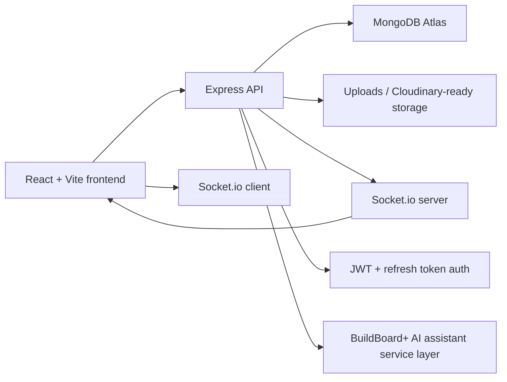
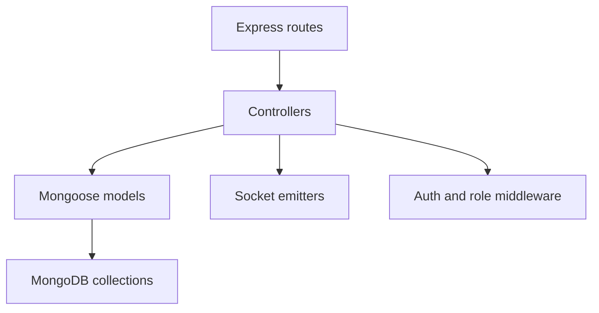
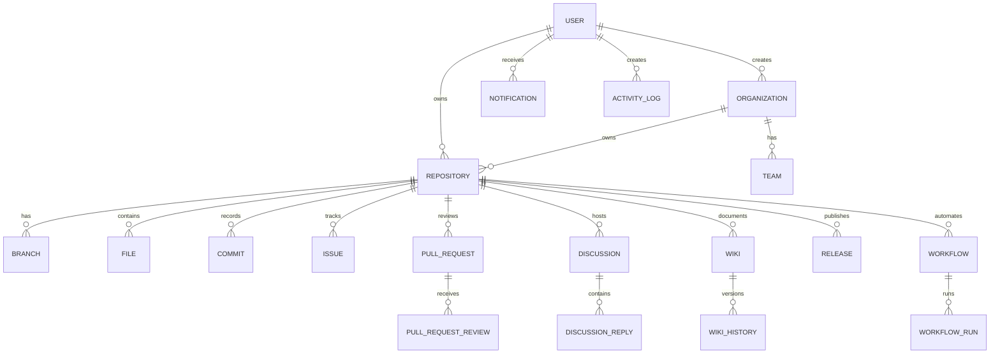
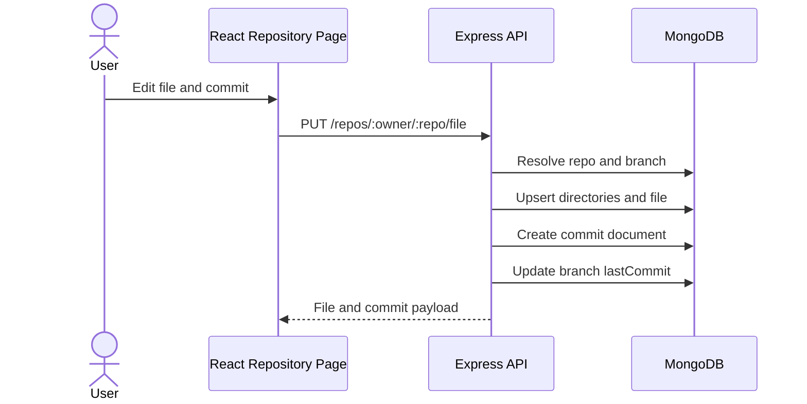
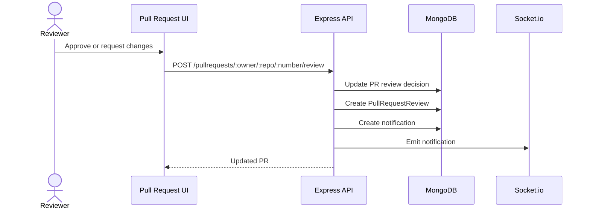
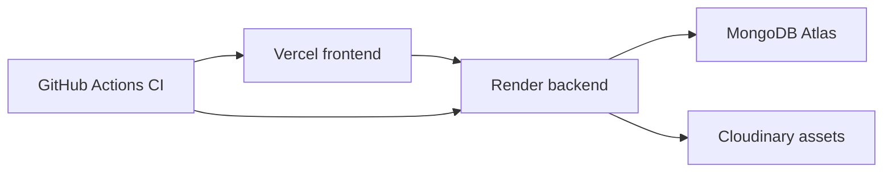

# Architecture and Diagrams

## System Architecture

```mermaid
flowchart LR
  Browser["React + Vite frontend"] --> API["Express API"]
  Browser --> Socket["Socket.io client"]
  API --> Mongo["MongoDB Atlas"]
  API --> Uploads["Uploads / Cloudinary-ready storage"]
  API --> SocketServer["Socket.io server"]
  SocketServer --> Browser
  API --> Auth["JWT + refresh token auth"]
  API --> AI["BuildBoard+ AI assistant service layer"]
```

## Backend Modules

```mermaid
flowchart TD
  Routes["Express routes"] --> Controllers["Controllers"]
  Controllers --> Models["Mongoose models"]
  Controllers --> SocketIO["Socket emitters"]
  Controllers --> AuthMiddleware["Auth and role middleware"]
  Models --> MongoDB["MongoDB collections"]
```

## ER Diagram

```mermaid
erDiagram
  USER ||--o{ REPOSITORY : owns
  USER ||--o{ ORGANIZATION : creates
  ORGANIZATION ||--o{ TEAM : has
  ORGANIZATION ||--o{ REPOSITORY : owns
  REPOSITORY ||--o{ BRANCH : has
  REPOSITORY ||--o{ FILE : contains
  REPOSITORY ||--o{ COMMIT : records
  REPOSITORY ||--o{ ISSUE : tracks
  REPOSITORY ||--o{ PULL_REQUEST : reviews
  REPOSITORY ||--o{ DISCUSSION : hosts
  REPOSITORY ||--o{ WIKI : documents
  REPOSITORY ||--o{ RELEASE : publishes
  REPOSITORY ||--o{ WORKFLOW : automates
  WORKFLOW ||--o{ WORKFLOW_RUN : runs
  PULL_REQUEST ||--o{ PULL_REQUEST_REVIEW : receives
  DISCUSSION ||--o{ DISCUSSION_REPLY : contains
  WIKI ||--o{ WIKI_HISTORY : versions
  USER ||--o{ NOTIFICATION : receives
  USER ||--o{ ACTIVITY_LOG : creates
```

## Repository File Commit Sequence

```mermaid
sequenceDiagram
  actor User
  participant UI as React Repository Page
  participant API as Express API
  participant DB as MongoDB
  User->>UI: Edit file and commit
  UI->>API: PUT /repos/:owner/:repo/file
  API->>DB: Resolve repo and branch
  API->>DB: Upsert directories and file
  API->>DB: Create commit document
  API->>DB: Update branch lastCommit
  API-->>UI: File and commit payload
```

## Pull Request Review Sequence

```mermaid
sequenceDiagram
  actor Reviewer
  participant UI as Pull Request UI
  participant API as Express API
  participant DB as MongoDB
  participant Socket as Socket.io
  Reviewer->>UI: Approve or request changes
  UI->>API: POST /pullrequests/:owner/:repo/:number/review
  API->>DB: Update PR review decision
  API->>DB: Create PullRequestReview
  API->>DB: Create notification
  API->>Socket: Emit notification
  API-->>UI: Updated PR
```

## Deployment Architecture

```mermaid
flowchart LR
  Vercel["Vercel frontend"] --> Render["Render backend"]
  Render --> Atlas["MongoDB Atlas"]
  Render --> Cloudinary["Cloudinary assets"]
  GitHubActions["GitHub Actions CI"] --> Vercel
  GitHubActions --> Render
```

